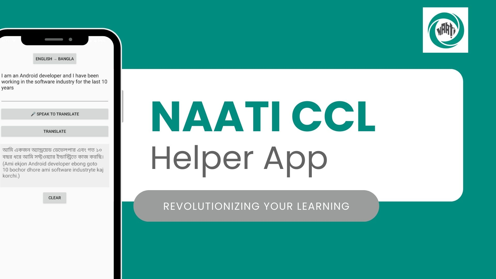

# NaatiHelper-Translator 📱🇧🇩🇦🇺

AI-powered Bengali ↔ English Translation Practice App for NAATI CCL Exam Preparation

NaatiHelper is an Android app designed to help Bengali–English language learners practice real-world translations interactively, especially for the NAATI CCL exam. It combines speech input and AI-powered contextual translations to make learning efficient and engaging.

## Features 🎯

🔁 Bidirectional Translation – Translate English ↔ Bangla using natural language prompts.

🎤 Speech Input – Speak directly to the app for fast translation practice.

🧠 AI-Powered – Uses Google Gemini Generative AI for contextually accurate translations.

💡 Toggle Directions – Switch easily between Bangla→English and English→Bangla.

🧪 Modern Android Architecture – Built in Kotlin using Android View system, structured for MVVM, Coroutines, and future Jetpack Compose integration.

## Demo

## Installation
1. Clone the repository: git clone https://github.com/sumaiyamunira/NaatiHelper-Translator.git

2. Open the project in Android Studio.

3. Obtain a Google Gemini API key for translation.

4. Add your API key to the project: val GEMINI_API_KEY = "YOUR_API_KEY_HERE"

5. Build and run the app on an emulator or physical device.

## Contribution
This project is open source! Contributions and feedback are welcome:

1. Fork the repository

2. Create a feature branch (git checkout -b feature-name)

3. Commit your changes (git commit -m 'Add new feature')

4. Push to the branch (git push origin feature-name)

5. Open a Pull Request

## License

This project is licensed under the MIT License. See LICENSE for details.

## Keywords / Tags

#AndroidDev #Kotlin #JetpackCompose #AIinApps #NAATI #SideProject #OpenSource #SpeechRecognition #BilingualTech #GenerativeAI #Bangla
